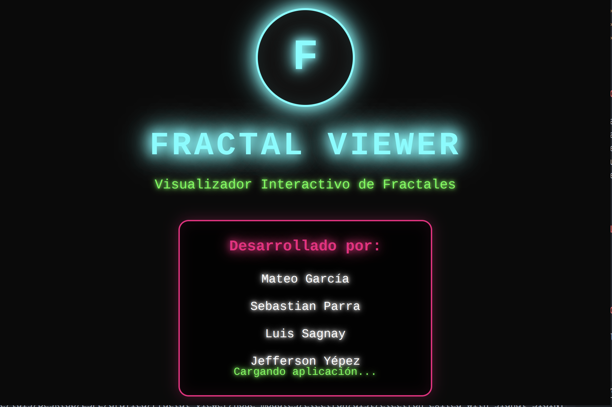
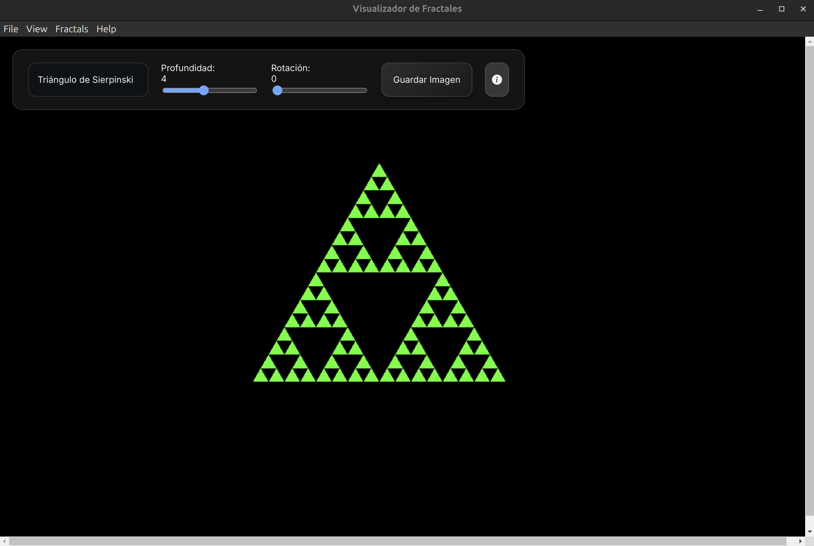
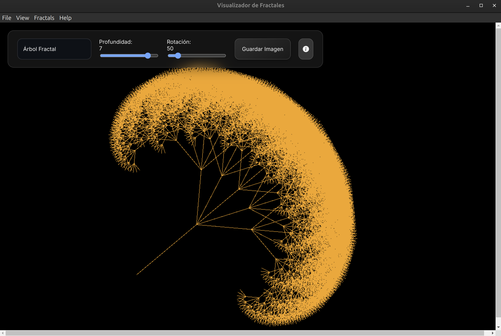
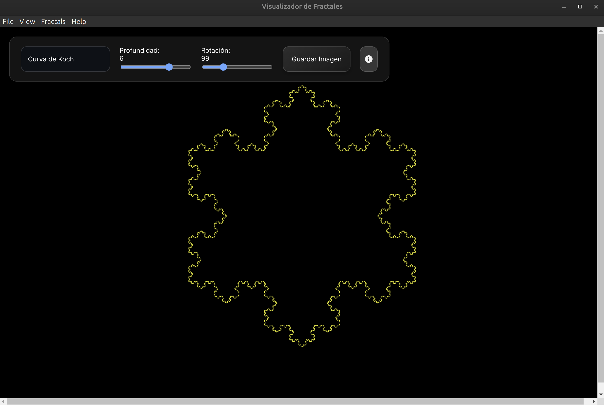
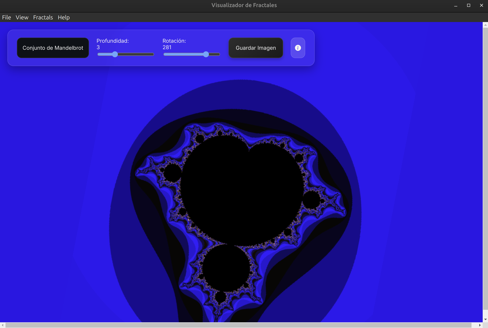
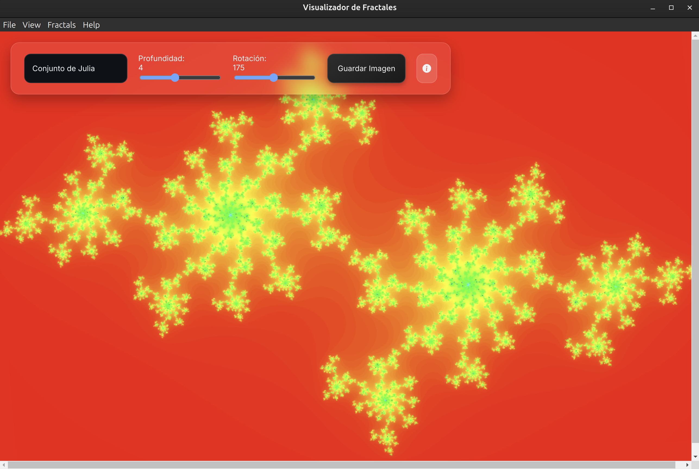

# Fractal Viewer - Aplicación de Escritorio

**Fractal Viewer** es una aplicación de escritorio interactiva para visualizar y explorar fractales clásicos, construida con [Electron](https://www.electronjs.org/) y [PIXI.js](https://pixijs.com/). Permite manipular parámetros visuales, guardar imágenes y obtener información educativa sobre cada fractal.

## Características

- **Visualización interactiva de múltiples tipos de fractales:**
  - Triángulo de Sierpinski
  - Curva de Koch
  - Árbol Fractal
  - Conjunto de Mandelbrot
  - Conjunto de Julia
- Control de profundidad/iteraciones
- Rotación interactiva
- Funciones de zoom y paneo
- Guardar imágenes
- Información detallada sobre cada fractal

## Capturas de Pantalla








## Instalación y Ejecución

### Prerrequisitos
- [Node.js](https://nodejs.org/) (v16 o superior)
- [Yarn](https://yarnpkg.com/) o [npm](https://www.npmjs.com/)

### Instalación

1. Clona el repositorio:
```bash
git clone https://github.com/Sebas-Parra/Fractal-viewer.git
cd Fractal-viewer
```

2. Instala las dependencias:
```bash
yarn install
```

### Ejecución

#### Modo desarrollo
```bash
yarn dev
```

#### Modo producción
```bash
yarn start
```

### Construcción de la aplicación

#### Para todas las plataformas
```bash
yarn build
```

#### Para plataformas específicas
```bash
yarn build:win    # Windows
yarn build:mac    # macOS
yarn build:linux  # Linux
```

## Estructura del Proyecto

```
├── Public/
│   ├── index.html      # Archivo HTML principal
│   └── style.css       # Estilos CSS
├── Fractals/           # Módulos de fractales
│   ├── sierpinski.js
│   ├── koch.js
│   ├── fractalTree.js
│   ├── mandelbrot.js
│   └── julia.js
├── Interactions/       # Módulos de interacción
│   ├── zoom.js
│   └── pan.js
├── Information/        # Módulos de información
│   ├── modalHandler.js
│   └── info.js
├── assets/            # Iconos y recursos
├── main.js           # Lógica principal de la aplicación
├── electron-main.js  # Proceso principal de Electron
└── package.json      # Configuración del proyecto
```

## Controles

- **Selector de Fractal**: Cambia entre diferentes tipos de fractales
- **Control de Profundidad**: Ajusta la complejidad del fractal
- **Control de Rotación**: Rota el fractal visualmente
- **Teclas de Flecha**: Izquierda/Derecha para rotar (incrementos de 5°)
- **Ratón**: Zoom (rueda) y arrastre (para ciertos fractales)
- **Ctrl+S**: Guardar imagen

## Tecnologías Utilizadas

- **Electron**: Framework para aplicaciones de escritorio
- **PIXI.js**: Renderizado gráfico 2D acelerado por WebGL
- **JavaScript ES6+**: Lógica de la aplicación
- **HTML5/CSS3**: Interfaz de usuario

## Licencia

MIT
